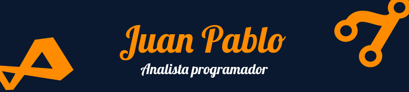

### Hola! 👋

Soy **Juan Pablo Ramírez**, un programador chileno 🇨🇱 recién titulado en **Técnico en Programación y Análisis de Sistemas**.

💻 Estoy empezando mi carrera profesional con mucho entusiasmo y ganas de **aprender, crear y aportar valor** con todo mi talento y habilidades en el mundo de la tecnología.

### 🔹 Sobre mí

- Apasionado por la programación y el desarrollo de software.
- Me gusta aprender nuevas tecnologías y mejorar continuamente.
- Siempre dispuesto a colaborar en proyectos y desafíos innovadores.

### 🔹 Habilidades

# Tecnologias

   
   
   
   
   
   
   
   

<!--
**Thewreex/Thewreex** is a ✨ _special_ ✨ repository because its `README.md` (this file) appears on your GitHub profile.

Here are some ideas to get you started:

- 🔭 I’m currently working on ...
- 🌱 I’m currently learning ...
- 👯 I’m looking to collaborate on ...
- 🤔 I’m looking for help with ...
- 💬 Ask me about ...
- 📫 How to reach me: ...
- 😄 Pronouns: ...
- ⚡ Fun fact: ...
-->
